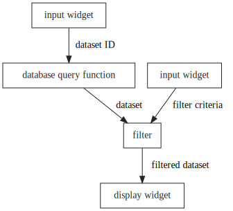

Feature Overview
================

<script>
    init_alia_demos(['stateful-component', 'addition-ui', 'numerical-analysis']);
</script>

In alia, the interactive portion of your application is expressed as functional
components: composable, declarative functions that take in application state and
declare the contents of your UI and how it should behave. When writing this
'component-level' code, you are essentially programming in a mini-paradigm
within C++.

All the major features of alia are about enabling this paradigm and making it
more efficient and more expressive...

The Data Graph
--------------

It's a fact of life that UI components require some degree of persistence across
updates: internal state must be retained, system resources must be managed,
calculated results must be cached, etc.

But there's a fundamental tension between this requirement and a declarative UI
interface: How do we map the output of the declarative UI function back to the
persistent data from the last update?

alia's solution to this is to track the control flow of your component-level
code so that every time you invoke a component, alia knows *where in your
control flow graph* that invocation came from and can make sure that *it's
consistently associated with the same persistent data.*

This tracking mechanism effectively creates a data structure that mirrors the
control flow graph of your component-level code, so alia calls this [the data
graph](the-data-graph.md).

This means that the component functions you write (and those you invoke) can
leverage this structure to maintain persistent data that's local to a *single
invocation* of that component within the UI.

For example, let's implement a small "flashcard" app for learning square roots:

```cpp
// This implements a single "flashcard" component.
// 'n' is the number that the user is trying to guess.
void
do_sqrt_flashcard(dom::context ctx, readable<int> n)
{
    // Put this whole component inside an 'item' div...
    dom::scoped_div div(ctx, value("item"));

    // Show the square.
    dom::do_text(ctx, n * n);

    // Get the local state we need for this component.
    auto answer_revealed = get_state(ctx, false);

    // If the answer is revealed, show it. Otherwise show a button to reveal it.
    alia_if(answer_revealed)
    {
        dom::do_text(ctx, printf(ctx, "The square root is %d.", n));
    }
    alia_else
    {
        dom::do_button(ctx, "Show Answer", answer_revealed <<= true);
    }
    alia_end
}

// Do the main UI for the "app".
void
do_app_ui(dom::context ctx)
{
    dom::do_text(ctx, "Try to figure out the square roots of these numbers...");
    do_sqrt_flashcard(ctx, value(9));
    do_sqrt_flashcard(ctx, value(4));
    do_sqrt_flashcard(ctx, value(5));
    do_sqrt_flashcard(ctx, value(17));
    do_sqrt_flashcard(ctx, value(4));
}
```

<div class="demo-panel">
<div id="stateful-component"></div>
</div>

Notice that although we're invoking the same function multiple times, each
invocation has its own value for `answer_revealed`. Even the two invocations
with the same arguments (the two `4`s) are independent.

Dataflow Semantics
------------------

In declarative UI programming, it's useful to think of your application as
defining a flow of data that starts at your application state and goes out to
the UI layer. In between, your data might pass through (and be transformed by)
HTTP requests or simple, pure C++ functions. As you update your application
state, those changes automatically propagate through whatever flow you've
defined and drive changes in the UI.

For example, if our application is supposed to allow the user to enter a dataset
ID, pull up the corresponding data, and then filter it based on some criteria,
we might reason about the application like this:



In alia, when you write component-level code, rather than working with 'raw' C++
value types like `int`, `std::string` or `std::vector<float>`, your variables
have *signal* types. A signal is simply a value that changes over time, but you
can think of them as having *dataflow semantics.* Invoking operators on or
applying functions to signals is the equivalent of setting up nodes in your
dataflow. (All of the arrows in the above diagram would be signals in alia.)

In particular, signals extend 'raw' C++ values in two important ways:

- **value identity** - Signals are designed to allow you to efficiently detect
  when their values have changed, independent of the size of those values. This
  allows nodes in your data flow to efficiently detect when their inputs have
  changed and propagate those changes forward. (alia takes a non-intrusive,
  polling-based approach to this.)

- **availability** - It's often useful to think of a signal in your data flow as
  carrying no value at all (e.g., because the user hasn't input a value yet, or
  because the value is still being computed or queried from some remote source).
  Since this "not available yet" state tends to propagate through a data flow,
  virtually all code that works with signals has to account for it. With alia
  signals, this state is implicitly part of the type and implicitly propagates
  through your application's data flow.

To see that last point in action, let's write a quick little component that adds
two numbers:

```cpp
void
do_addition_ui(dom::context ctx, duplex<double> a, duplex<double> b)
{
    dom::do_text(ctx, "Enter two numbers to add:");

    dom::do_input(ctx, a);
    dom::do_input(ctx, b);

    dom::do_text(ctx, a + b);
}
```

<div class="demo-panel">
<div id="addition-ui"></div>
</div>

As simple as this example is, it's actually setting up a dataflow (via the `+`
operator). Notice that the sum doesn't actually appear until we supply a value
for both `a` and `b`. The result of the `+` operator itself is a signal, and if
either of its inputs is unavailable, that state implicitly propagates through to
the sum.

alia even provides [adaptors](signal-adaptors.md#availability) for working with
the availability of a signal as a property.

Actions
-------

While the data graph helps you model the *structure* of your UI declaratively
and signals help you model the *computations* in your UI declaratively,
[actions](actions.md) help you model the *transitions* in your UI declaratively.

Actions are, in a nutshell, declarative descriptions of the side effects that
should happen in response to the events that occur in your UI. There was one in
the "flashcard" example above:

```cpp
dom::do_button(ctx, "Show Answer", answer_revealed <<= true);
```

The expression `answer_revealed <<= true` constructs an action that sets the
state signal `answer_revealed` to `true`, and whenever the button is pressed, it
performs that action.

Synergy
-------

The various features of alia tend to work together in unexpectedly nice ways...

Since the component functions that describe your UI are driven by application
state, a state-altering action is often all you need to respond to an event and
effect the necessary changes in the system, and the data flow mechanics are
often what you need to construct the new values for your state.

Since the data graph allows you to persist data in arbitrary parts of your
component functions, the parts that are responsible for data flow can easily
cache their results.

Since the control flow tracking mechanisms that alia uses to maintain the data
graph work with signals, they implicitly understand the concept of a control
flow decision being *unresolved.* For example, let's write a UI that classifies
a number as positive, negative, or zero:

```cpp
auto n = get_state(ctx, empty<double>());

dom::do_text(ctx, "Enter a number:");

dom::do_input(ctx, n);

alia_if(n > 0)
{
    dom::do_text(ctx, "The number is positive!");
}
alia_else_if(n < 0)
{
    dom::do_text(ctx, "The number is negative!");
}
alia_else
{
    dom::do_text(ctx, "The number is zero!");
}
alia_end
```

<div class="demo-panel">
<div id="numerical-analysis"></div>
</div>

Notice that although our `if`/`else` branches have seemingly accounted for all
possibilities on the number line, there is still the possibility that we haven't
filled in the input yet and `n` doesn't have a value. The alia macros account
for this automatically, and in that case, none of the branches are taken.
